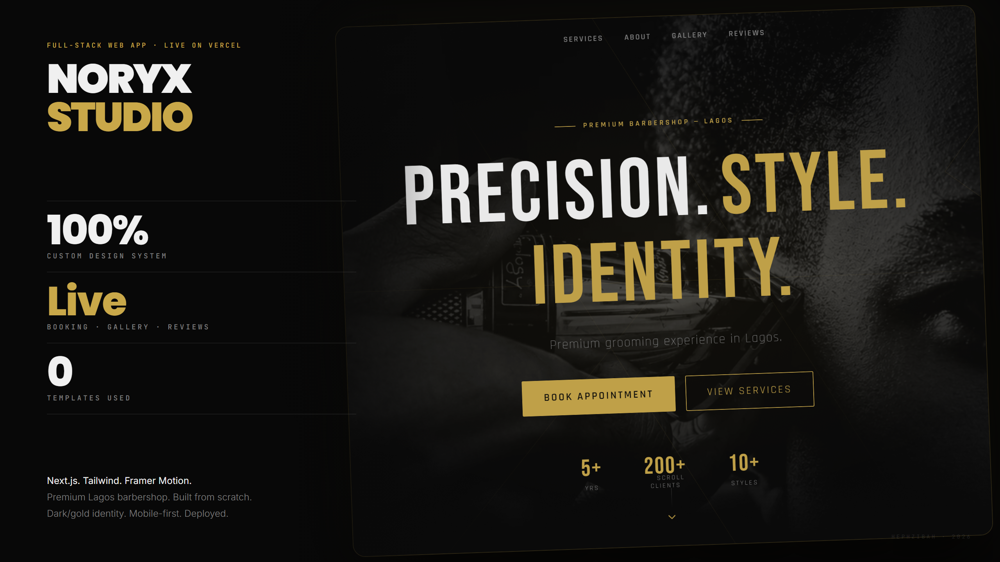
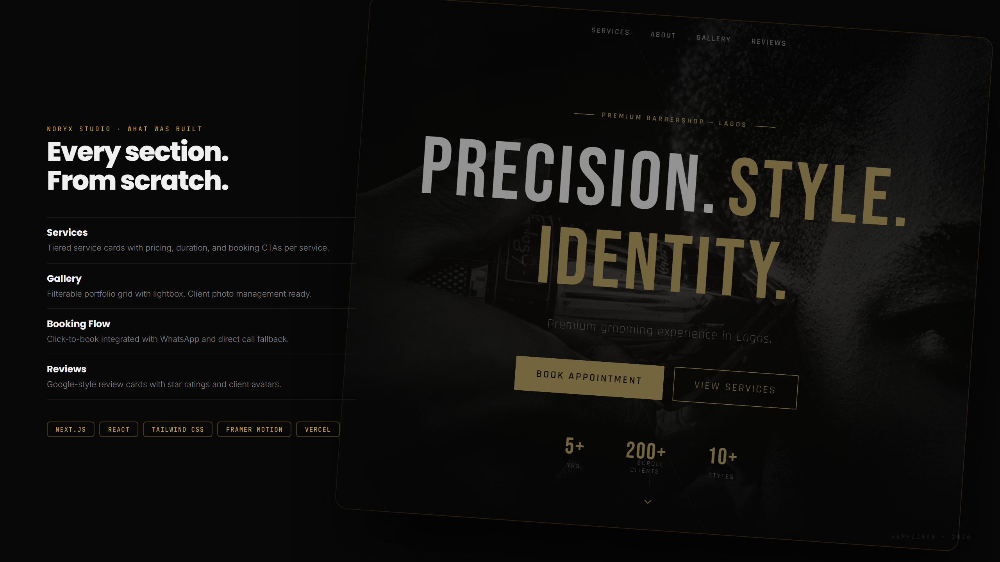

# Noryx Studio

**A production-grade full-stack booking platform for a premium barbershop — built from scratch with a security-first data layer, race-safe scheduling, and edge-rendered performance.**

[](https://github.com/m1r4g3-code/noryx-studio/actions/workflows/ci.yml)


<p align="center">
  
</p>

<p align="center">
  
</p>

---

## What this is

Noryx Studio is a two-sided web application: a public-facing marketing and booking site, and a private admin console that runs the business behind it. It was built end-to-end — design system, booking engine, notification pipeline, and database security model — rather than assembled from a template.

The interesting part isn't the UI. It's what's underneath it:

- **A database that doesn't trust the client.** Every table is governed by Postgres Row-Level Security. The anon key can create a booking; it cannot read anyone else's name, phone number, or appointment history. Availability is exposed only through a `SECURITY DEFINER` RPC (`booked_times(date)`) that returns *busy time slots*, never the underlying rows — closing a PII leak that a naive "public read on appointments" policy would otherwise create.
- **A booking engine that can't double-book.** Concurrent requests for the same slot are resolved by a partial unique index at the database level, not by a client-side check-then-write race. The server action catches the resulting `23505` and returns a clean "slot just got taken" response instead of corrupting the calendar.
- **Defense applied in layers, not once.** Zod schemas validate shape at the edge; server actions re-validate business rules (working hours, lead time, slot availability) before touching the database; RLS enforces the final boundary regardless of what the API layer does. A bug in one layer doesn't collapse the whole model.
- **Abuse-resistant by default.** Booking and review submission are rate-limited at the database layer, independent of any edge middleware — so the protection survives regardless of hosting provider or CDN configuration.
- **Fast because it's cached correctly, not because it's small.** Public data (services, settings, approved reviews, gallery) sits behind a tagged Next.js data-access layer with ISR; the homepage and gallery are statically rendered and revalidate on demand when an admin publishes a change — full CMS-like freshness without a database round-trip on every visit.

## Architecture at a glance

```
┌─────────────────────────────┐        ┌──────────────────────────────┐
│         Public Site         │        │        Admin Console          │
│  Hero · Services · Gallery  │        │  Appointments · Services      │
│  Reviews · Booking Flow     │        │  Reviews · Gallery · Settings │
└───────────────┬─────────────┘        └───────────────┬────────────────┘
                │  server actions                       │  auth-gated
                │  (Zod-validated)                       │  server actions
                ▼                                        ▼
┌─────────────────────────────────────────────────────────────────────┐
│                     Next.js 14 App Router (RSC)                     │
│   middleware.ts — session revalidation via supabase.auth.getUser()  │
│   lib/data/*    — cached, tag-revalidated read layer (ISR)          │
└───────────────────────────────┬───────────────────────────────────────┘
                                │
                                ▼
┌─────────────────────────────────────────────────────────────────────┐
│                  Supabase (PostgreSQL + Row-Level Security)          │
│  • booked_times() RPC — availability without exposing PII            │
│  • partial unique index — double-booking prevention at the DB layer  │
│  • DB-backed rate limiting on public write paths                     │
│  • 4 layered migrations: schema → gallery → integrity → lockdown     │
└───────────────────────────────┬───────────────────────────────────────┘
                                │
                    ┌───────────┴────────────┐
                    ▼                        ▼
              Gmail SMTP               Twilio SMS
          (booking / status emails)   (booking / status texts)
```

## Engineering decisions worth calling out

| Decision | Why it matters |
|---|---|
| `getUser()` instead of session decode in middleware | A decoded JWT can be stale or forged client-side; `getUser()` revalidates against the Supabase Auth server on every protected request. |
| Availability via RPC, not table SELECT | The obvious implementation (`SELECT * FROM appointments WHERE date = ...`) leaks every client's name and phone number to any visitor. The RPC returns time ranges only. |
| Partial unique index for slot locking | Prevents the classic "two people click Book at the same millisecond" bug without introducing application-level locking or a queue. |
| Tag-based ISR revalidation | Admin edits to services/settings/gallery invalidate exactly the affected cache tag — the public site stays static and fast without going stale after a change. |
| Client-side image compression before upload | Gallery photos are resized to 1600px WebP in-browser before hitting storage, cutting a 2.4MB upload down by over 90% without a server-side processing step. |
| Migrations as an audit trail | Security fixes (`003_security_and_integrity.sql`, `004_lock_public_writes.sql`) are separate, reviewable migrations rather than edits folded back into the original schema — the hardening is traceable. |

## Tech Stack

| Layer | Choice |
|---|---|
| Framework | **Next.js 14** (App Router, React Server Components, Server Actions) |
| Language | **TypeScript**, strict mode |
| Styling | **Tailwind CSS 3** with a custom design system (dark / gold identity) |
| Data & Auth | **Supabase** — PostgreSQL, Row-Level Security, session auth |
| Validation | **Zod** schemas shared between client forms and server actions |
| Forms | **React Hook Form** |
| Scheduling UI | **react-day-picker v8** |
| Email | **Gmail SMTP** via Nodemailer |
| SMS | **Twilio** |
| Testing | **Vitest** (unit tests for booking references, currency/date formatting, validation schemas) |
| CI | **GitHub Actions** — type-check, lint, test, build on every push/PR |
| Hosting | **Vercel** |

---

## Quick Start

### 1. Clone and install

```bash
git clone https://github.com/m1r4g3-code/noryx-studio.git
cd noryx-studio
npm install
```

### 2. Configure environment

```bash
cp .env.local.example .env.local
```

Edit `.env.local` with your credentials:

```env
# Required — from your Supabase project settings
NEXT_PUBLIC_SUPABASE_URL=https://your-project.supabase.co
NEXT_PUBLIC_SUPABASE_ANON_KEY=your-anon-key
SUPABASE_SERVICE_ROLE_KEY=your-service-role-key

# Email notifications (Gmail SMTP)
GMAIL_USER=you@gmail.com
GMAIL_APP_PASSWORD=xxxx-xxxx-xxxx-xxxx

# SMS notifications (https://twilio.com)
TWILIO_ACCOUNT_SID=ACxxxx
TWILIO_AUTH_TOKEN=xxxx
TWILIO_FROM_NUMBER=+1234567890
```

### 3. Set up the database

Run the migrations **in order** against your Supabase project (SQL Editor, or the CLI):

```
supabase/migrations/
├── 001_initial_schema.sql        # Tables, indexes, base RLS, seed data
├── 002_gallery.sql                # Gallery table + storage policies
├── 003_security_and_integrity.sql # booked_times() RPC, double-booking lock, PII lockdown
└── 004_lock_public_writes.sql     # Remove public INSERT — writes route through server actions only
```

### 4. Create an admin user

In Supabase → Authentication → Users → Add user, with your admin email/password.

### 5. Run development server

```bash
npm run dev
```

Open [http://localhost:3000](http://localhost:3000)

---

## Project Structure

```
noryx-studio/
├── app/
│   ├── page.tsx                        # Public homepage
│   ├── gallery/page.tsx                # Statically rendered (ISR) gallery
│   ├── review/page.tsx                 # Client review submission
│   ├── book/
│   │   ├── page.tsx                    # 4-step booking flow
│   │   └── actions.ts                  # createAppointment server action (validated + rate-limited)
│   └── admin/
│       ├── login/page.tsx              # Admin login
│       └── (protected)/                # Auth-gated via middleware.ts
│           ├── page.tsx                # Dashboard overview
│           ├── appointments/           # Appointments management
│           ├── services/               # Services CRUD
│           ├── reviews/                # Reviews moderation
│           ├── gallery/                # Gallery upload manager
│           └── settings/               # Site + notification settings
├── components/
│   ├── public/                         # Homepage sections
│   ├── booking/                        # Booking flow components
│   ├── dashboard/                      # Admin components
│   └── ui/                             # Reusable primitives
├── lib/
│   ├── data/                           # Cached, tag-revalidated read layer
│   ├── supabase.ts / supabase-server.ts
│   ├── notifications.ts                # Email (Gmail SMTP) + SMS (Twilio)
│   ├── validations.ts                  # Zod schemas (shared client/server)
│   ├── utils.ts                        # cn(), formatCurrency(), generateReference(), etc.
│   └── core.test.ts                    # Vitest unit tests
├── types/index.ts                      # All TypeScript types
├── middleware.ts                       # Session revalidation + /admin/* auth gate
├── .github/workflows/ci.yml            # Type-check, lint, test, build
└── supabase/migrations/                # Layered schema + security migrations
```

---

## Notification System

When a client books an appointment, the **barber** is notified. When the barber **confirms, cancels, or completes** an appointment, the **client** is notified.

**Channels (each independently optional, wired by env presence):**
- Email via **Gmail SMTP**
- SMS via **Twilio**

Barber contact is configured in Admin → Settings → Notifications. Client emails are HTML-escaped before rendering into the notification template.

---

## Admin Dashboard

| Page | Path |
|---|---|
| Overview | `/admin` |
| Appointments | `/admin/appointments` |
| Services | `/admin/services` |
| Gallery | `/admin/gallery` |
| Reviews | `/admin/reviews` |
| Settings | `/admin/settings` |

---

## Database Tables

| Table | Description |
|---|---|
| `services` | Barbershop services — price, duration, visibility |
| `appointments` | Bookings with status tracking; PII locked behind RLS, availability exposed only via `booked_times()` |
| `reviews` | Client reviews with an approval workflow before public display |
| `gallery` | Portfolio images, admin-managed |
| `settings` | Key-value site configuration (JSON) |

---

## Quality & CI

Every push and pull request to `main` runs, in order: **type-check → lint → unit tests → production build.** No merge lands without passing all four.

```bash
npm run dev         # Start development server
npm run build       # Production build
npm run start       # Run production build
npm run type-check  # TypeScript type checking
npm run lint        # ESLint
npm test            # Vitest unit tests
```

---

## Contact

- WhatsApp: [09162035059](https://wa.me/2349162035059)
- Email: sain.tcuts3@gmail.com
